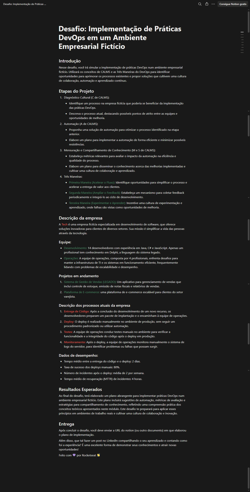
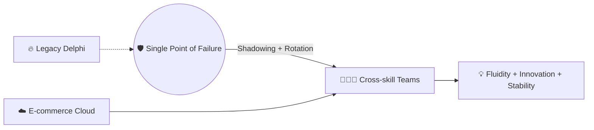
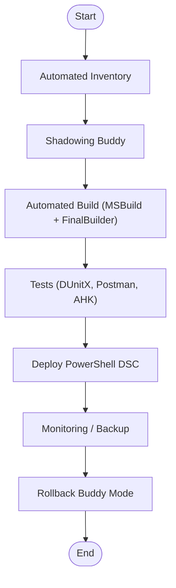

# 🚀 Tech DevOps Evolution Plan

---

## 🌟 Overview

> Breaking silos: How Tech is evolving into a resilient, fluid, and secure DevOps-driven organization.

---

## 🖼️ Challenge Context



*Figure: Exercise context screenshot from Rocketseat DevOps Challenge 01.*

---

## 📊 Visual Summary



---

## 🗺️ Macro Roadmap

| Sprint/Quarter      | Key Deliverable                              | Success Measure                          |
|---------------------|----------------------------------------------|------------------------------------------|
| Sprint 0            | Visual kickoff + buddy assignment            | All roles assigned and engaged           |
| Week 1              | MVP pipeline, happiness baseline             | Automated deploy for E-commerce, emoji   |
| Week 2              | Buddy recording, WIP board, survey           | Screen recording + workflow active       |
| Q1                  | Cloud full CI/CD, buddy system operational   | Lead time <1d, >70% team upskilled       |
| Q2                  | Legacy automated build/test/rollback, docs   | 100% deploy doc coverage, MTTR <2h       |
| Q3                  | Automated staging for Delphi, onboarding refresh | >40% coverage on new code           |
| Ongoing             | Game days, quizzes, cross-team pairing, feedback loop | CHI ≥ 4.0, Bus Factor ≥ 3        |

---

## 🔄 Buddy Rotation System

**Quarterly Rotation Structure:**
- **Buddy 1:** Delphi Specialist + Senior E-commerce Dev
- **Buddy 2:** Ops Lead + Junior Legacy Dev
- **Buddy 3:** Security Champion + Business Analyst

**Ceremonies:**
- ⏲ Weekly hand-off: 30min sync + docs always updated
- 🤝 Co-pairing: 2h/week on critical tasks
- 📈 Metric: “Bus Factor” ≥ 3 (at least 3 people know every critical process)

---

## 📈 Adaptive Governance

- **Bi-weekly Reviews**
  - Health Check: Workload emojis (🟢🟡🔴) + justification
  - Velocity Review: Scope adjustment if <70% of goals reached
  - Celebration Board: 3 small wins celebrated
- **Framework:**
  - If 2+ devs in 🔴 twice in a row → urgent priority review
  - Happiness <3.5 → Sprint focused on well-being/tech health

---

## 🎓 Continuous Learning Engine

- **Onboarding Program (First 30 days):**
  - 🧳 Day 1: DevOps Starter Kit + sandbox
  - 🤝 Week 1: Pair with buddy + review 5 critical runbooks
  - 🚦 Month 1: First supervised deploy + 360° feedback

- **Quarterly Refresh**
  - Watch a key screen recording
  - 10-min pipeline quiz
  - Mandatory update of one runbook as exercise

---

## 🗣️ Customer Voice Integration

- **Feature Feedback:** In-app NPS after releases
- **Game Day Comms:** Pre-game day email, opt-out for critical users
- **Change Advisory:** Biweekly “What Changed” newsletter
- **Metric:** CSAT after release > 4.2/5

---

## 🎪 Workload & Focus Management

- **WIP Limit:** Max 3 parallel initiatives/team
- “Focus Sprint”: 1/month purely for technical debt
- **Visual Board:** Physical or digital Kanban with column limits
- **DevOps Dashboard:**
  - Workload heatmap per person
  - Cycle time by task type
  - Weekly “focus score” (0-100%)

---

## 🔁 Knowledge Refresh Protocol

- **Quarterly:**
  - “Challenge Day”: New buddy executes critical procedure solo
  - 10% of runbooks randomly audited
  - Cross-team quizzes

- **If >30% fail the quiz → Mandatory knowledge sharing sprint**

---

## 📈 Cultural Health Index (CHI)

| Indicator                | Target        |
|--------------------------|--------------|
| Psychological Safety     | > 4.0        |
| Knowledge Distribution   | Bus Factor ≥ 3|
| Sustainable Pace         | ≤ 20% 🔴     |
| Continuous Learning      | ≥ 85% refreshed |
| Cross-team Collaboration | 2 pairings/week |

---

## 🚦 TL;DR Runbooks

> **For every critical process:**  
> - Up to 5 emergency steps  
> - Flow diagram  
> - Short video  
> - Quick checklist

---

## 🏦 Legacy Delphi Workflow (Example)


*All steps require a video guide and runbook update in each pull request.*

---

## 🎮 Gamification Integrated

- **DevOps Leaderboard:** Champions, badges, “Top 3 cool docs”
- **Workload Emoji Board:** Weekly team check-in
- **User Feedback Board:** Customers suggest features and rate releases
- **Wall of Learning:** Main lessons highlighted quarterly

---

## 🔒 Security / Compliance Automation

- **Pipeline as Code (IaC + Security):**  
```typescript
new aws.ec2.Instance("db", {
  instanceType: "t3.medium",
  tags: { "compliance": "pci-dss" }
});
```
- **Universal vault, SIEM, auditing, policy as code**
- **Weekly pipeline security review**

---

## 🧮 Sustainable Sprint Review Checklist

- Documentation updated?  
- Buddy rotation confirmed?  
- Onboarding completed?  
- Emojis Workload ≤ 20% 🔴?  
- 3 public wins celebrated?  
- Customer CSAT feedback gathered?

---

## 🤝 Engagement + Celebrations

> **Every win celebrated = reinforced motivation.**  
> Recognition: DevOps Champion + digital badges  
> Anonymous happiness survey every 2 sprints!

---

## 🏅 Conclusion

- **From silo to flow:** People, culture, process, and legacy moving forward—together.
- **Guaranteed Adaptation:** Ceremonies and metrics correct course before debt accrues.
- **Sustainable Tech:** Engagement, innovation, security, and learning as permanent values.

---

## 📞 Contact
<p>
  <a href="https://www.linkedin.com/in/pedro-solozabal/" target="_blank">
    
  </a>
  <a href="https://github.com/solozabal" target="_blank">
    
  </a>
  <a href="https://t.me/pedrosolozabal" target="_blank">
    
  </a>
</p>

---
